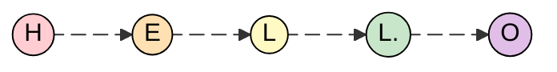

```mermaid
flowchart LR
    H(("H")) L_H_E_0@--> E(("E"))
    E L_E_L_0@--> L(("L"))
    L L_L_L._0@--> L.(("L."))
    L. L_L._O_0@--> O(("O"))

    style H stroke:#000000,fill:#FFCDD2,color:#000000
    style E stroke:#000000,fill:#FFE0B2,color:#000000
    style L stroke:#000000,fill:#FFF9C4,color:#000000
    style L. stroke:#000000,fill:#C8E6C9,color:#000000
    style O stroke:#000000,fill:#E1BEE7,color:#000000

    L_H_E_0@{ animation: slow } 
    L_E_L_0@{ animation: slow } 
    L_L_L._0@{ animation: slow } 
    L_L._O_0@{ animation: slow } 
```
